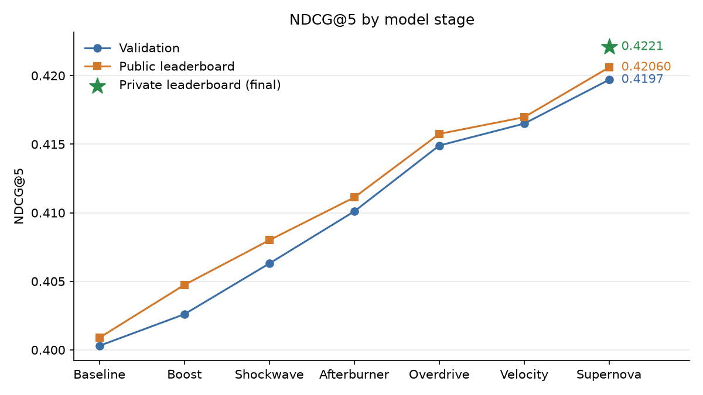
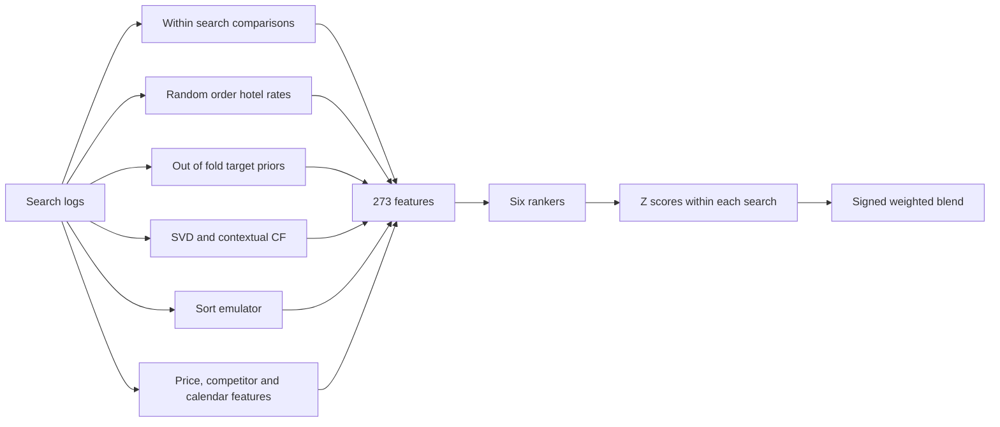
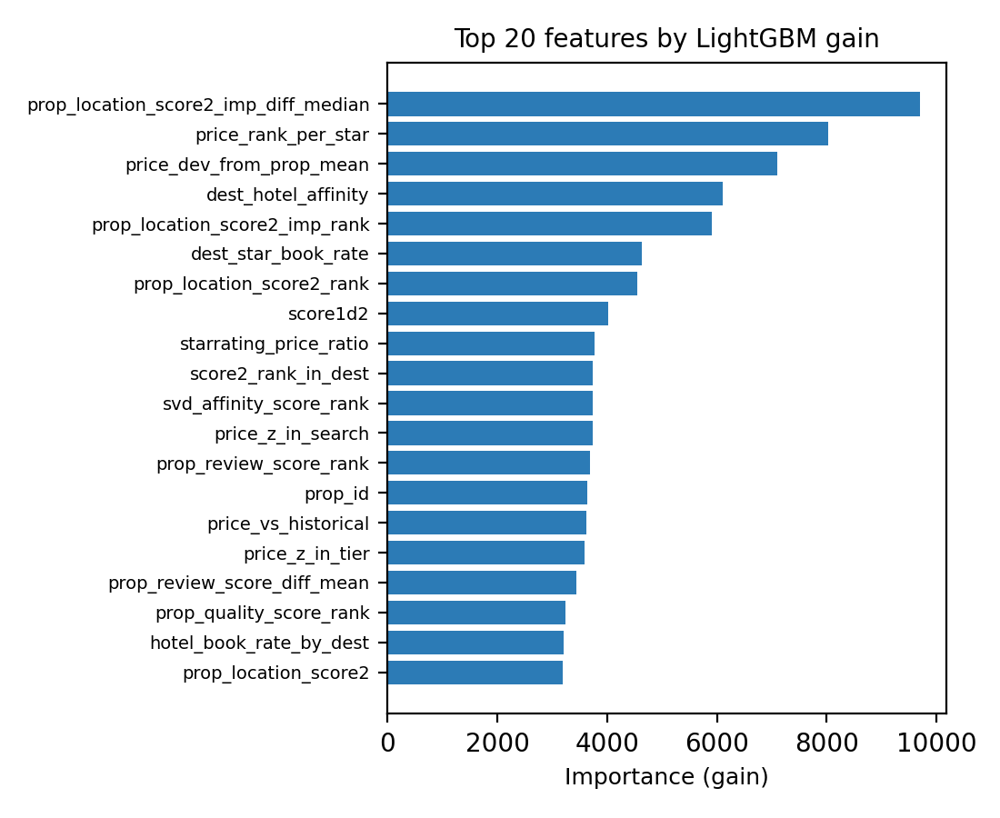
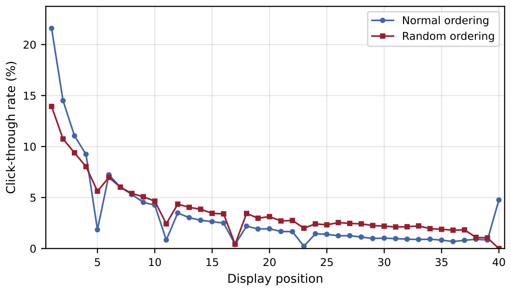
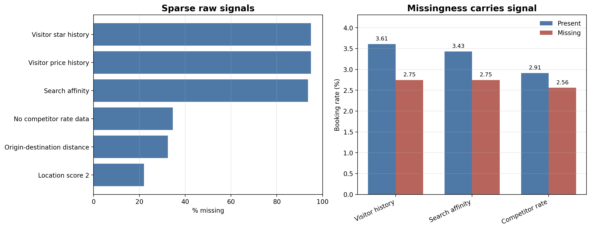

# Hotel Trivago, but its Expedia

Learning to rank for hotel search. A signed blend of six gradient boosted rankers over 273 features, trained on Expedia search logs, which finished 8th of 146 teams on the private leaderboard of a university Kaggle competition with an NDCG@5 of 0.4221.

## The problem

Someone searches Expedia for a hotel and gets back a list of around 25 properties. The goal is to reorder that list so the hotel they end up booking sits at the top, with the ones they click right behind it. Scoring uses NDCG@5 with a relevance of 5 for a booking, 1 for a click and 0 otherwise, so the booked hotel has to land in the first five slots.

The data is the course's version of the [Personalize Expedia Hotel Searches](https://www.kaggle.com/c/expedia-personalized-sort) dataset (ICDM 2013), with about 5 million rows each in train and test. Every row pairs one search with one hotel that was shown, with price, star rating, review score, location scores, competitor prices and, for training rows, the display position and whether the user clicked or booked.

## Results

| Model | Validation NDCG@5 | Public LB | Private LB |
|---|---|---|---|
| Sort by `prop_location_score1`, no model | 0.1727 | | |
| SVD collaborative filtering alone | 0.2196 | | |
| First pointwise and LambdaRank blend | 0.4003 | 0.40089 | |
| CatBoost YetiRank alone | 0.4052 | | |
| Best single model, RankXENDCG over 5 seeds | 0.4196 | | |
| Meta-stacker over the six models, not submitted | 0.4213 | | |
| **Final signed blend of six models** | **0.4197** | **0.42060** | **0.4221** |
| Competition winner | | 0.42640 | 0.42678 |

The private score came out above both the validation and the public score. The meta-stacker had the best validation mean, but one of its ten folds dropped to 0.4124 and the fold standard deviation was 0.0046, so the steadier blend went in instead. The private result is consistent with that choice.



## How it works



**Features.** 273 in total. The largest group compares each hotel with the rest of its search, since a $200 hotel means one thing when it is the cheapest option and another when it is the most expensive. Price, stars, review score and both location scores each get a rank inside the search and the gap to the search mean and median. The rest are competitor aggregates, flags for hotels that are both cheaper and better rated than the alternatives, price residuals against the market median, and calendar features.



**Target priors.** Hotel popularity is one of the strongest signals and the easiest place to leak labels. Booking and click rates per hotel, per destination and star tier, and per hotel and booking window are encoded out of fold with a 5 fold `GroupKFold` on `srch_id` and Bayesian smoothing (m = 50). Finer keys back off to the hotel level rate when support is thin.

**Position bias.** Hotels near the top of the list get clicked more whether they are good or not. About 30% of training rows come from searches shown in random order, which gives a cleaner look at what users actually prefer.



The first slot gets a 21.5% click rate under normal ordering against 14.0% under random ordering. Hotel rates computed from the random rows only (smoothed with m = 30) sit next to the all impression priors, so the model can tell a popular hotel from one that was simply placed high.

**Missing values.** Nulls carry signal, so they are kept as flags rather than filled in. Visitor history is 94.9% null, and searches with a purchase history book at 3.61% against 2.75% without.



**Collaborative filtering.** Truncated SVD on a destination by hotel matrix from the random order rows (5 for a booking, 1 for a click) gives 20 factors on each side plus affinity scores. On its own it ranks at 0.2196, far behind the trees, but as features it earns its place and an SVD affinity rank is in the top 20 by gain.

**Sort emulation.** Test rows have no `position`. A separate LightGBM model learns to predict Expedia's display position using only features that exist at test time. Its score and its rank inside the search stand in for the part of Expedia's own ranking that is otherwise lost.

**Models.** Six rankers on the same 273 features.

| Model | Objective | Validation NDCG@5 | Blend weight |
|---|---|---|---|
| Pointwise | LightGBM binary on `booking_bool` | 0.4162 | 22.4% |
| Click | LightGBM binary on `click_bool` | 0.4112 | 5.0% |
| LambdaRank | LightGBM `lambdarank` | 0.4143 | 17.1% |
| LambdaRank@5 | `lambdarank` with truncation level 5 | 0.4128 | 22.1% |
| RankXENDCG | LightGBM `rank_xendcg`, 5 seeds averaged | 0.4196 | 25.1% |
| CatBoost | YetiRank | 0.4052 | 8.4% |

Rank gains are linear (5 and 1) to match the competition's NDCG, and each RankXENDCG seed drops 35% of the non booked hotels per search so the five seeds see different data. Hyperparameters are in Table 1 of the [report](report/report.pdf).

**Blending.** Each model's scores become z scores within the search and are combined with signed weights fitted by Nelder-Mead on validation NDCG@5. CatBoost is the weakest model alone and still gets 8.4%, because its symmetric trees and pairwise loss make different mistakes from the LightGBM models. Reciprocal rank fusion reached 0.4187.

**Validation.** 20% of searches are held out with `GroupShuffleSplit` on `srch_id`, so every hotel of a search stays on the same side. The final models are retrained on all 4,958,347 training rows for the best iteration counts found on validation.

## Bias

The model ranks some users better than others. International searches score 0.4069 against 0.4279 for domestic, and searches with children 0.4363 against 0.4149 without, an equalized performance ratio (lowest over highest) of 0.951 for both. The international gap is a data problem. The median international country pair has 43 rows against 214 for a domestic one, so the debiased rates are noisiest exactly where the model is weakest. Two mitigations were tested and neither closed it.

| Variant | Overall | Domestic | International | Ratio |
|---|---|---|---|---|
| Single RankXENDCG model, no change | 0.4182 | 0.4253 | 0.4060 | 0.9545 |
| International searches weighted 1.7 in training | 0.4167 | 0.4240 | 0.4044 | 0.9539 |

Weighting international searches during training made both groups slightly worse. A post processing boost of +0.02 to international hotels left every ranking unchanged, because only 68 of 39,959 validation searches mix domestic and international hotels, and adding the same constant to every hotel in a search cannot reorder it.

## Lessons

- **Diversity had to come from the objective and the algorithm.** Making the first two LightGBM models deeper improved both, yet their blend gained only +0.0022 over the better one. Adding RankXENDCG and CatBoost, which rank differently, moved the ensemble far more than tuning did.
- **The best validation number was not the one to submit.** A meta-stacker beat the plain blend on validation in three stages running and was unstable across folds each time. The signed blend went in every time from Overdrive onwards and the leaderboard kept moving up.
- **The late gains came from new information.** The two biggest late jumps on the leaderboard, +0.00463 and +0.00363, came from new feature blocks (per hotel priors and dominance features, then hierarchical priors, sort emulation and price residuals), not from parameter changes.

The full history, including the stages that never ran, is in [docs/experiments.md](docs/experiments.md).

## Running it

```bash
python -m venv .venv && source .venv/bin/activate
pip install -r requirements.txt
```

Put the competition files in `data/` as `data/training_set_VU_DM.csv` and `data/test_set_VU_DM.csv`, then run the main notebook top to bottom.

```bash
jupyter lab notebooks/supernova.ipynb
```

It trains the six models, fits the blend, retrains on the full training set and writes `submission_supernova.csv`, which takes more than an hour. Without a GPU, set `CATBOOST_TASK_TYPE = "CPU"` in the configuration cell (LightGBM falls back on its own). `USE_SAMPLE = True` runs on a 15% sample instead.

The bias work reads the validation predictions that the main notebook saves to `outputs/supernova_validation_predictions.parquet`.

```bash
jupyter lab notebooks/bias_international_weighting.ipynb
python scripts/check_bias_metrics.py      # segment metrics and the +0.02 boost check
python scripts/report_artifacts.py        # booking rate and feature importance figures
python scripts/plot_score_progression.py  # the score progression figure, no data needed
```

`pytest` runs a small suite on synthetic search logs covering NDCG@5, the blend and leakage checks on the out of fold priors.

## Project layout

```
notebooks/
    supernova.ipynb                       final pipeline, validation run and submission
    bias_international_weighting.ipynb    weighted training check for the international gap
    eda.ipynb                             exploratory analysis
    missingness_and_position_bias.ipynb   null patterns and position bias
src/
    utils.py                              loading with compact dtypes, NDCG@5, submission writer
    features.py                           within search, price, competitor and temporal features
    position_features.py                  hotel rates from random order searches
    svd_features.py                       SVD collaborative filtering features
    final_pipeline.py                     priors, dominance features, z scores and blending
scripts/                                  bias metrics and figures
tests/                                    unit tests on synthetic data
outputs/                                  run metadata and metrics from the final runs
docs/                                     experiment log and figures
report/report.pdf                         the full report
```

## Credits

The full write up is in [report/report.pdf](report/report.pdf). Built with Anushka Sen and Prita Suresh as a team project for the Data Mining Techniques course at Vrije Universiteit Amsterdam. The dataset belongs to Expedia and was provided through the course's Kaggle competition. The data from the original 2013 competition was not used.
