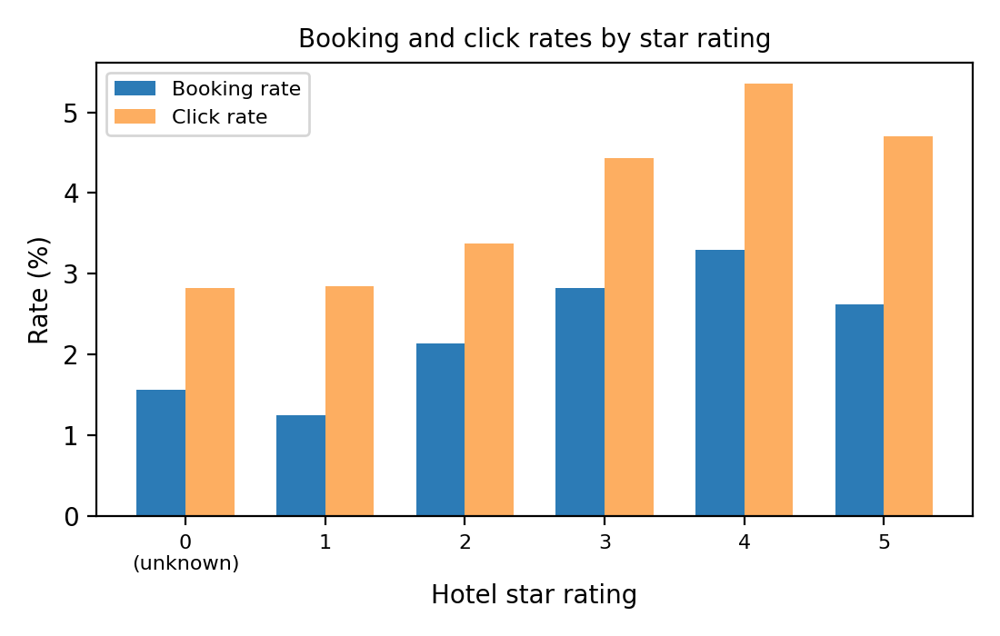

# Experiment log

Three and a half weeks, 1 to 24 May 2026. Scores are NDCG@5. "Val" is the 20% holdout of searches split on `srch_id` with seed 42, used for every stage. Public LB is the half of the test set Kaggle scored during the competition, and the private score on the other half was revealed after it closed. Each stage got a name and its own notebook. The earlier notebooks were dropped from the final tree and are still in the git history.

## Scoreboard

| Stage | Val | Public LB | Date | What changed |
|---|---|---|---|---|
| Baseline | 0.4003 | 0.40089 | 1 to 8 May | Pointwise LightGBM and LambdaRank on 136 features, 50/50 blend |
| Boost | 0.4026 | 0.40474 | 8 to 10 May | Deeper regularised trees, imputed location score, dropped zero gain features |
| Nitro | | | 10 May onwards | Planned, never ran |
| Shockwave | 0.4063 | 0.4080 | by 16 May | RankXENDCG, CatBoost YetiRank and optimised blends, 172 features |
| Afterburner | 0.4101 | 0.41112 | by 16 May | Context features and target priors, 214 features, out of fold meta-ranker |
| Overdrive | 0.4149 | 0.41575 | 16 May | Per hotel priors and dominance features, 236 features, signed z blend |
| Velocity | 0.4165 | 0.41697 | 17 May | LambdaRank@5, RankXENDCG over five seeds, contextual features, 254 features |
| Apex | | | 17 May | Planned, shelved after Supernova |
| **Supernova** | **0.4197** | **0.42060** | **17 May** | **Hierarchical priors, sort emulation, price residuals, 273 features. Final submission** |

The final submission scored 0.4221 on the private leaderboard, 8th of 146 teams.

## Where the gains came from

| Change | Leaderboard gain |
|---|---|
| Deeper regularised trees and feature fixes (Boost) | +0.00385 |
| New ranking objectives and CatBoost (Shockwave) | +0.00326 |
| Context features, target priors and the meta-ranker (Afterburner) | +0.00312 |
| **Per hotel priors, dominance features and the signed blend (Overdrive)** | **+0.00463** |
| Seed averaging and contextual features (Velocity) | +0.00122 |
| Hierarchical priors, sort emulation and price residuals (Supernova) | +0.00363 |
| Total, Baseline to Supernova | +0.01971 |

## Notes on the main steps

**Baseline (1 to 8 May).** Data loading with compact dtypes, the `srch_id` split, the first EDA, and a feature table with within search ranks, price and value features, competitor aggregates, missing flags, temporal features, hotel rates from random order searches and SVD features. Pointwise LightGBM on `booking_bool` scored 0.3982 and LambdaRank 0.3911, so the pointwise model was the stronger one from the start. A 50/50 blend reached 0.4003. SVD alone scored 0.2196, against 0.1727 for sorting by `prop_location_score1`. Booking rates by star rating peak at four stars (3.3%) and dip at both ends, which pointed at price and quality together rather than stars alone.

**Boost (8 to 10 May).** One change at a time, kept only if validation went up by at least 0.0005. The keepers were two location score features from Liu et al., filling missing `prop_location_score2` from training rows while keeping its missing flag, dropping features with zero gain, and deeper trees (511 leaves, L1 0.1, L2 1.0, 200 minimum child samples). Pointwise went to 0.4004, LambdaRank to 0.3944 and the blend to 0.4026. The family and domestic gaps first showed up here.

**Nitro (from 10 May).** Never produced a run, because of machine and runtime problems. Its useful output was a diagnosis. The two models shared most of their top features, the same feature table and similar parameters, and a rank based blend of them added nothing. The answer was different objectives and a different algorithm, not more LightGBM tuning, and Shockwave picked that up.

**Shockwave.** Added LightGBM with the `rank_xendcg` objective, a longer LambdaRank, CatBoost YetiRank and a Huber regression on the graded labels. RankXENDCG became the best single model at 0.4048. CatBoost scored 0.3902 alone but took about 22% of the selected blend. Huber regression scored 0.3674 and got no weight. An optimised minmax blend was selected at 0.4063, a hair ahead of a z score blend and well ahead of reciprocal rank fusion (0.4017).

**Afterburner.** The feature table grew to 214 with price normalised by destination and star tier, search context and price spread features, and destination by star and hotel by booking window target priors. A click model joined the ensemble, CatBoost trained longer (0.3976), and the blend moved to signed z scores (0.4085). An out of fold meta-ranker over the base scores did better still at 0.4101 and was submitted. One of its five folds was weak at 0.4012.

**Overdrive (16 May).** Out of fold per hotel booking, click and click only priors, per hotel price aggregates and choice set dominance features took the table to 236. Linear rank gains beat LightGBM's default exponential ones. RankXENDCG reached 0.4142 and the signed z blend 0.4149. The meta-ranker scored higher again (0.4170) but had a fold at 0.4087, so the signed blend was submitted. A leave one model out check found click and LambdaRank both close to neutral.

**Velocity (17 May).** Added a LambdaRank truncated at 5, averaged RankXENDCG over five seeds and brought in a contextual feature block, taking the table to 254. The selected blend reached 0.4165. The raw meta-ranker scored 0.4188 and had a weakest fold of 0.4046, so it stayed a diagnostic.

**Apex (17 May).** A cautious follow up to Velocity built around a shrunken version of the meta-ranker and segment corrections. The notebook was written, and then Supernova scored well enough that it never ran.

**Supernova (17 May).** Built on the Velocity pipeline and added the larger feature blocks. A LightGBM sort emulator predicts Expedia's display position from test time features. Hierarchical priors back off from hotel by destination, visitor country and booking window down to the hotel level. There are site and visitor destination conditioned CF scores and price residuals against market conventions, and each of the five RankXENDCG seeds drops 35% of the non booked hotels in every search. Base models scored between 0.4052 (CatBoost) and 0.4196 (RankXENDCG). The signed blend reached 0.4197 out of fold. A 10 fold meta-stacker averaged 0.4213 with a fold at 0.4124 and stayed out. Public 0.42060, private 0.4221.

**Bias work (19 to 24 May).** Measured NDCG@5 and Recall@5 by segment on the Supernova validation predictions. International searches score 0.4069 against 0.4279 for domestic, and families 0.4363 against 0.4149 for searches without children, an equalized performance ratio of 0.951 for both. Retraining one RankXENDCG model with international searches weighted 1.7 lowered overall NDCG@5 from 0.4182 to 0.4167 and the ratio from 0.9545 to 0.9539. A +0.02 score boost for international hotels changed nothing, since only 68 of 39,959 validation searches mix domestic and international hotels.

## Things that failed along the way

- LambdaRank as the main model. It trailed the plain pointwise classifier in every early run.
- Blends of two LightGBM models trained on the same features, with rank correlation around 0.97 and almost no gain.
- Huber regression on graded relevance (0.3674).
- A click only model (0.2762) and a position unbiased RankXENDCG (0.2780) in Afterburner.
- Reciprocal rank fusion, which trailed the z score blends at every stage.
- The meta-ranker from Overdrive onwards, higher on average and unstable across folds every time.
- Separate blend weights for domestic and international searches, worth only +0.0002.
- A second stage reranker over each model's top 15, which scored 0.245.
- XGBoost rankers, tried on a side branch and never brought into the main pipeline.
- Both bias mitigations for the international gap.
